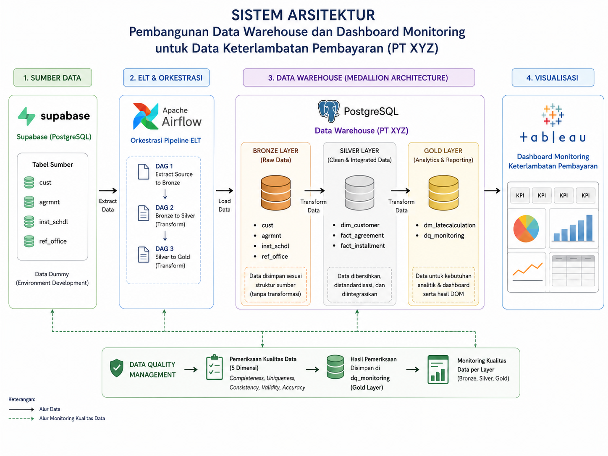

# Late Payment Data Warehouse and Monitoring Dashboard

An end-to-end data warehouse and late-payment monitoring dashboard developed using PostgreSQL, Apache Airflow, Tableau, and Data Quality Management.

## Overview

This project integrates agreement, installment, customer, and branch reference data into a PostgreSQL data warehouse using a Medallion Architecture.

The data pipeline is orchestrated with Apache Airflow and consists of:

- Bronze Layer for raw source data
- Silver Layer for cleaned and standardized data
- Gold Layer for late-payment calculations and dashboard-ready data

Data-quality checks are applied across five dimensions:

- Accuracy
- Completeness
- Consistency
- Validity
- Uniqueness

## Architecture



## Dashboard Preview


## Project Structure

```text
late-payment-data-warehouse-dashboard/
├── dags/
├── data/
│   └── sample/
├── docs/
├── screenshots/
├── sql/
│   ├── bronze/
│   ├── silver/
│   ├── gold/
│   └── data_quality/
├── tableau/
├── .gitignore
└── README.md
